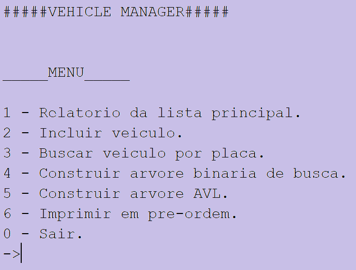

<h1 align="center"> Vehicle Manager </h1>

Projeto desenvolvido durante a disciplina de Algoritimos II na Universidade Federal de Alfenas no curso Ciencias da Computação.   

  <a href="#-tecnologias">Tecnologias</a>&nbsp;&nbsp;&nbsp;|&nbsp;&nbsp;&nbsp;
  <a href="#-projeto">Projeto</a>&nbsp;&nbsp;&nbsp;|&nbsp;&nbsp;&nbsp;
  <a href="#-layout">Layout</a>&nbsp;&nbsp;

  

 

## 🚀 Tecnologias

Esse projeto foi desenvolvido com as seguintes tecnologias:

- C++
- Git e Github

## 💻 Projeto

O Vehicle Manager é um aplicativo desenvolvido para auxiliar vendedores de automóveis a organizar seu portifólio e também fazer buscas, exclusões e adições. No código são utilizadas listas encadeadas e arvores(binária de busca e avl) como estruturas para as operações com os veiculos. 

## 🔖 Layout

O projeto foi desenvolvido em C++, portanto o layout é referente ao terminal.
